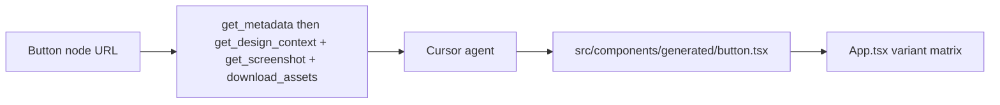

# Figma-to-React Agent MVP

Prove that Cursor + Figma MCP can generate a real presentational React component. The test is **one button and all of its variants** — not pages, not a classifier, not a gallery of many components.

**Figma MCP is the only data source** — no REST API, no personal access token, no fetch/axios client. This is a showcase of agentic conversion, not a compiler.

Later (after this button looks right in the browser): cards, icons, then a full page split into child components.

## Todos

- [x] Scaffold Vite + React + TS + Tailwind in figma-automation with a simple gallery page
- [x] Connect Figma MCP (official Figma plugin / `https://mcp.figma.com/mcp`) and complete OAuth
- [ ] Add a thin Cursor rule for the MCP-only **component** generate workflow
- [ ] Generate the demo button + variants from the Figma node below
- [ ] Register it on the gallery and visually compare to the Figma screenshot in the browser

## Test node

[Button in E-commerce UI Kit (demo)](https://www.figma.com/design/J6j1qHUXhzrXbmudDxnzqn/E-commerce-UI---Figma-Ecommerce-UI-Kit--Demo-Version---Community-?node-id=2787-276)

| | |
| --- | --- |
| fileKey | `J6j1qHUXhzrXbmudDxnzqn` |
| nodeId | `2787:276` (URL `node-id=2787-276` → colon for MCP) |

Treat this node as a **component** (likely a `COMPONENT_SET`). Do not invent variants, colors, type, or icons — pull them from MCP.

## What already exists

- Workspace: `figma-automation` — Vite + React + TS + Tailwind v4 gallery (`App.tsx` empty state).
- Figma MCP is connected in this Cursor session via the official plugin.
- `src/lib/figma/` is a placeholder. URL parsing / page-vs-component classification is **not** part of this MVP.

## Architecture (this slice)



The Vite app never talks to Figma. All Figma access happens through Cursor’s MCP tools while the agent is generating.

One file, one export, variant **props** (the design has a variant set — this is the point of the test). Gallery renders every combination so we can compare to Figma.

## MCP tools (the only Figma path)

Remote MCP: `https://mcp.figma.com/mcp`. Extract `fileKey` + `nodeId` from the pasted link (hyphen in `node-id=2787-276` → `2787:276`).

| Tool | When |
| --- | --- |
| [`get_metadata`](https://developers.figma.com/docs/figma-mcp-server/tools-and-prompts/) | First. Confirm type/name (component vs set) and list variant children. |
| [`get_design_context`](https://developers.figma.com/docs/figma-mcp-server/tools-and-prompts/) | Primary: React + Tailwind reference for the node. Adapt to this repo; do not paste verbatim. |
| [`get_screenshot`](https://developers.figma.com/docs/figma-mcp-server/tools-and-prompts/) | Visual reference for layout and every variant. |
| [`download_assets`](https://developers.figma.com/docs/figma-mcp-server/tools-and-prompts/) | SVG for any icons. Save under `src/assets/figma/` and import; do not invent placeholder icons. |
| [`get_variable_defs`](https://developers.figma.com/docs/figma-mcp-server/tools-and-prompts/) | Optional; map Figma variables to Tailwind when present. |
| [`get_context_for_code_connect`](https://developers.figma.com/docs/figma-mcp-server/tools-and-prompts/) | Optional; exhaustive variant axes/options if metadata is not enough. |

If MCP is unavailable or unauthenticated, stop. Do not call `api.figma.com`.

## Output

```
figma-automation/
  src/
    components/generated/
      <button-slug>.tsx     # kebab-case file, PascalCase export
    assets/figma/           # MCP-downloaded SVGs only if the button has icons
    App.tsx                 # gallery: matrix of all variants + Figma URL caption
  .cursor/rules/figma-to-react.mdc
```

Naming: layer name from metadata → slug. Example: `Button` → `src/components/generated/button.tsx` → `export function Button()`.

**Component contract**

- **UI only:** no `useState`, no click handlers, no data fetching.
- **Variants as props:** one prop per Figma variant axis (type, size, state, icon, …) with TypeScript unions matching the set. Default props = the component set’s default variant.
- **Styling:** Tailwind only. No CSS modules. No inline `style=` except where Tailwind cannot express something (gradients/filters).
- **Icons:** MCP-downloaded SVG sources as-is; do not add icon packs or hand-draw paths.
- Register the component on `App.tsx`. Show every variant (a labeled grid is enough). Caption with the original Figma URL.

No routing, auth, backend, `pages/` wrappers, or `parse-url` / `classify` for this slice.

## Agent contract (Cursor rule)

Add a **thin** `.cursor/rules/figma-to-react.mdc` so a generate request for this button follows:

1. Require Figma MCP. If tools are missing, stop and tell the user to connect `https://mcp.figma.com/mcp`.
2. Parse `fileKey` + `nodeId` from the pasted URL (`-` → `:` in the node id).
3. `get_metadata` on that node. If it is not a component / component set / instance, stop and say so — do not fall into page-generation.
4. `get_design_context` + `get_screenshot`. `download_assets` (SVG) if there are icons. Use `get_context_for_code_connect` if variant axes are unclear.
5. Write one file under `src/components/generated/`. Map every variant axis to props.
6. Register it on the gallery as a full variant matrix.
7. Load `/figma-design-to-code` before `get_design_context`. Treat MCP code as a reference; match this repo (React + Tailwind).

Example prompt:

> Generate a presentational React component from this Figma button, including all variants: `<url>`

## Out of scope for this MVP

- Page mode, walking children, `pages/` wrappers
- `parse-url.ts` / `classify.ts` and designer `page/` vs `comp/` prefixes
- Vue, Code Connect mappings, naming linters
- Pixel-perfect visual regression tests
- Interactive logic, forms, routing, Convex/backend
- Figma REST API, tokens, axios/fetch clients
- Generating a second component or a full screen

## After this works

1. A second component with variants (e.g. card or input) using the same rule.
2. Then page mode: classify, split children, compose a wrapper.

## Implementation order

1. Cursor rule for the component-only generate path.
2. In Agent mode, generate the test button from MCP (metadata → design context → screenshot → assets).
3. Wire the gallery variant matrix.
4. Compare in the browser to the Figma screenshot. Fix gaps (spacing, type, missing variants, icons) before expanding scope.
