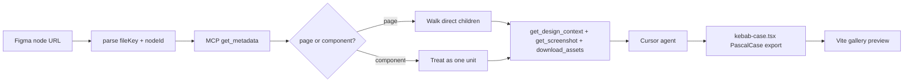

# Figma-to-React Agent MVP

A Vite + React + TypeScript + Tailwind gallery app, plus a Cursor agent workflow that turns a Figma node URL into a presentational React component. **Figma MCP is the only data source for this MVP** — no REST API, no personal access token, no fetch/axios client.

This is a **showcase of agentic conversion**, not a compiler. The agent uses MCP tools, then writes presentational React + Tailwind. A thin TypeScript layer only parses URLs and classifies page vs component from MCP metadata.

## Todos

- [x] Scaffold Vite + React + TS + Tailwind in figma-automation with a simple gallery page
- [ ] Add URL parser + page-vs-component classifier (from MCP metadata)
- [ ] Add Cursor rule + README for the MCP-only generate workflow and naming conventions
- [ ] Empty gallery state plus one sample generated component slot

## What already exists

- Workspace: `/Users/codingninja/Documents/Work/2026/learnings/figma/figma-automation` — git repo with GitHub remote, no app code yet.
- **Figma MCP is not connected in this Cursor session.** Connecting it is a hard prerequisite. Add Figma’s remote MCP (`https://mcp.figma.com/mcp`) in Cursor Settings → MCP (or install the official Figma plugin) and complete OAuth. If MCP tools are missing at generate time, stop and ask to connect MCP — do not invent a REST fallback.

## Architecture



Two layers, so classification can later be reused for Vue:

1. **Framework-agnostic core** (`src/lib/figma/`): parse a Figma URL; classify a node from MCP `get_metadata` (type, name, children).
2. **React adapter + agent rules**: Cursor writes `src/components/generated/*.tsx` (and `pages/` wrappers when the node is a full page) and registers them on a gallery page.

The Vite app never talks to Figma. All Figma access happens through Cursor’s MCP tools while the agent is generating.

## MCP tools (the only Figma path)

Remote MCP: `https://mcp.figma.com/mcp`. The agent extracts `fileKey` + `nodeId` from the pasted link (hyphen in `node-id=1-2` → `1:2` for tool calls).

| Tool | When |
| --- | --- |
| [`get_metadata`](https://developers.figma.com/docs/figma-mcp-server/tools-and-prompts/) | **Always first.** Sparse outline: type, name, children. Classify page vs component; list children before generating. |
| [`get_design_context`](https://developers.figma.com/docs/figma-mcp-server/tools-and-prompts/) | React + Tailwind intermediate representation for the target node (or each child in page mode). Not drop-in production code — translate into this repo’s conventions. |
| [`get_screenshot`](https://developers.figma.com/docs/figma-mcp-server/tools-and-prompts/) | Visual reference so the agent can match layout. |
| [`download_assets`](https://developers.figma.com/docs/figma-mcp-server/tools-and-prompts/) | SVG (or PNG) for icons/illustrations. Save under `src/assets/figma/` and import; do not invent placeholder icons. |
| [`get_variable_defs`](https://developers.figma.com/docs/figma-mcp-server/tools-and-prompts/) | Optional; map Figma variables to Tailwind classes when present. |

If MCP is unavailable or unauthenticated, the agent must stop. Do not call `api.figma.com`.

## Page vs component classification

A `node-id` in a Figma URL can be a whole page or a single modular piece. Classify **before** generating code. Do not dump a full page into one mega-component.

Always call `get_metadata` first. Then classify in this order — **explicit name wins, then Figma type, then children**:

### 1. Designer naming convention (override)

Layer names are the reliable switch when a `FRAME` is used as a screen (very common) and type alone is ambiguous.

| Layer name pattern | Mode | Example |
| --- | --- | --- |
| `page/...` or `[page] ...` (case-insensitive) | page | `page/login`, `[page] Dashboard` |
| `comp/...`, `component/...`, or `[comp] ...` | component | `comp/primary-button`, `[comp] Card` |
| no prefix | fall through to type + children | `Button / Primary` |

Parse the prefix, then slug the remainder for the kebab-case filename (`page/login` → `login`, `[comp] Primary Button` → `primary-button`).

### 2. Figma node type

| `type` (from `get_metadata`) | Mode |
| --- | --- |
| `CANVAS` (a Figma page) | page |
| `COMPONENT`, `COMPONENT_SET`, `INSTANCE` | component |
| `FRAME`, `GROUP`, `SECTION` | ambiguous — use naming, else children heuristic |
| everything else (`TEXT`, `VECTOR`, `BOOLEAN_OPERATION`, …) | component (single asset) |

### 3. Children heuristic (only if still ambiguous)

Inspect **direct** children in metadata (ignore hidden / non-visual nodes such as `SLICE`):

- **Page:** two or more direct children whose types are `FRAME`, `COMPONENT`, `INSTANCE`, or `GROUP` — a screen made of modules.
- **Component:** zero or one such child, or children that are only primitives (`TEXT`, `RECTANGLE`, `VECTOR`, …) — one widget.

When in doubt, treat as **component**. The naming prefix is how designers force page mode on a frame.

### What each mode generates

**Component mode** — one file:

- `src/components/generated/primary-button.tsx` → `export function PrimaryButton()`

**Page mode** — split, then compose:

1. Walk direct children from metadata.
2. Generate one presentational component per child under `src/components/generated/`.
3. Generate a page wrapper under `src/components/generated/pages/` that only lays those children out (UI-only, Tailwind, no logic). Filename from the page slug: `page/login` → `pages/login.tsx` → `export function LoginPage()`.
4. Gallery lists the page and each child, with the original Figma URL as caption.

`get_design_context` on a whole `CANVAS` often truncates. In page mode, call `get_design_context` / `get_screenshot` **per child** (and optionally once on the page for overall layout). `download_assets` for any icons those children need.

`parse-url.ts` and `classify.ts` stay in `src/lib/figma/` (no React) so a Vue adapter can reuse them later. Classification input is the MCP metadata payload, not a REST node dump.

## App scaffold

Vite + React + TS + Tailwind v4 (or v3 if v4 setup is noisy). Keep the surface tiny:

```
figma-automation/
  src/
    lib/figma/
      parse-url.ts          # URL → { fileKey, nodeId }
      classify.ts           # page vs component from MCP metadata
      types.ts
    components/generated/   # agent output: components
      pages/                # agent output: page wrappers
    assets/figma/           # MCP-downloaded SVGs
    App.tsx                 # gallery
  .cursor/rules/figma-to-react.mdc
```

No `.env`, no Figma token, no `scripts/fetch-figma-node.ts`.

Gallery (`App.tsx`): list generated components with the Figma node URL as a caption. Empty state explains “paste a Figma link in Cursor Agent and ask to generate.” No routing, no auth, no backend.

## Agent contract (Cursor rule)

Add `.cursor/rules/figma-to-react.mdc` so every generate request follows the same steps:

1. Require Figma MCP. If the tools are missing, stop and tell the user to connect `https://mcp.figma.com/mcp`.
2. Parse the pasted Figma URL with `parse-url` (`fileKey` + `nodeId`).
3. Call `get_metadata`. Classify with `classify.ts` (name prefix → type → children).
4. **Component:** `get_design_context` + `get_screenshot` on that node; `download_assets` with SVG for icons.
5. **Page:** do not generate one mega-file. For each direct child, `get_design_context` + `get_screenshot`, then write child components plus a `pages/` wrapper.
6. Emit **UI only**: no `useState`, no handlers, no data fetching. Props only if the design has obvious variants (optional for MVP; default is a static component).
7. Naming: file `src/components/generated/primary-button.tsx`; export `export function PrimaryButton()`. Pages: `src/components/generated/pages/login.tsx` → `export function LoginPage()`. kebab-case file, PascalCase function.
8. Styling: Tailwind only. No CSS modules, no inline `style=` except where Tailwind cannot express something (gradients/filters) — then keep it minimal.
9. Register generated files on the gallery page.
10. Use MCP-downloaded SVG sources as-is; do not add icon packs.

Example prompts the README will document:

> Generate a presentational React component from this Figma node: `<url>`

> Generate this Figma page as a wrapper plus child components: `<url>`

## Out of scope for MVP

- Figma REST API, personal access tokens, axios/fetch clients
- Vue (keep `src/lib/figma` free of React so a Vue adapter can come later)
- Enforced naming linters / Code Connect
- Pixel-perfect visual regression tests
- Interactive logic, forms, routing, Convex/backend

## Prerequisites you do before coding

1. Connect Figma remote MCP in Cursor (`https://mcp.figma.com/mcp`) and complete OAuth.
2. Pick demo nodes of both kinds: one `comp/...` (button/card/icon) and one `page/...` (or a Figma `CANVAS`) with at least two child frames.

## Implementation order

1. Scaffold Vite React TS + Tailwind in `figma-automation`.
2. Implement `parse-url` + `classify.ts` (input = MCP metadata shape).
3. Add the Cursor rule and a short README (MCP setup, example prompts, `page/` vs `comp/` naming, output paths).
4. Gallery empty state + one hand-written sample component so the page is not blank.
5. After you approve, generate from both a component URL and a page URL in Agent mode (MCP only) and visually compare to Figma screenshots in the browser.
